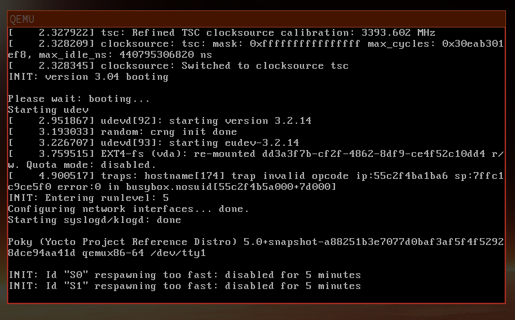
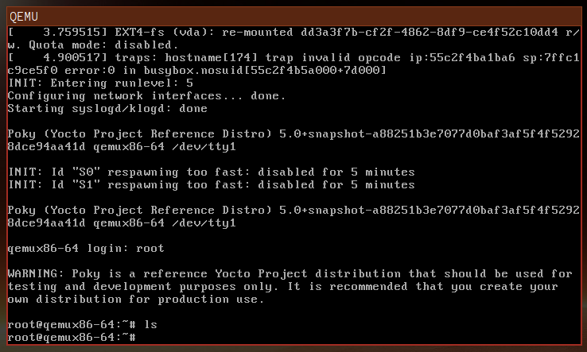
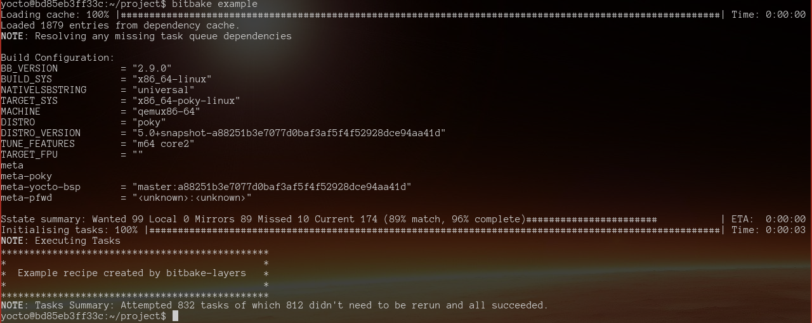
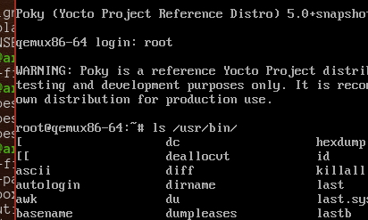
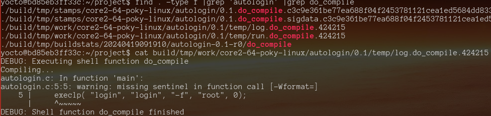

# Simple Yocto Project

Create docker container

    docker build --tag yocto/build:v1 .

Run container:

    docker run --rm -it -v $(pwd):/home/yocto/project yocto/build:v1

Clone poky:

    cd /home/yocto/project
    git clone git://git.yoctoproject.org/poky
    cd poky/
    # build/ will be created by the script
    source ./oe-init-build-env /home/yocto/project/build

You will now be in the build directory:

    usee@host /home/yocto/project/build $ _

Build the minimal image (this will take some time):

    bitbake core-image-minimal

By default the image will be built for qemu:

    ...
    MACHINE              = "qemux86-64"
    ...

## Output

The results will be available in `tmp/deploy/images/qemux86-64` and can be
executed with the `runqemu` script. Of course, as with any complex system this
is probably **too** convenient (which is to say that when you are trying to
understand what is happening it is just confusing and will probably not work
under docker anyway). To execute the build with a basic QEMU installation:

    qemu-system-x86_64 -nodefaults -vga vmware -cpu IvyBridge -machine q35,i8042=off \
        -drive file=build/tmp/deploy/images/qemux86-64/core-image-minimal-qemux86-64.rootfs-20240417154755.ext4,if=virtio,format=raw \
        -kernel build/tmp/deploy/images/qemux86-64/bzImage-qemux86-64.bin \
        -append 'root=/dev/vda rw  oprofile.timer=1 tsc=reliable no_timer_check rcupdate.rcu_expedited=1 swiotlb=0 '



The `runqemu` command will output the `qemu-system-x86_64` command line if the
check for a network is disabled. To disable the check for network connectivity:

```
def check_tun():
    """Check /dev/net/tun"""
    dev_tun = '/dev/net/tun'
#    if not os.path.exists(dev_tun):
#        raise RunQemuError("TUN control device %s is unavailable; you may need to enable TUN (e.g. sudo modprobe tun)" % dev_tun)
#
#    if not os.access(dev_tun, os.W_OK):
#        raise RunQemuError("TUN control device %s is not writable, please fix (e.g. sudo chmod 666 %s)" % (dev_tun, dev_tun))
```

It is also possible to execute the following command and see the VM output via
VNC to the container:

    # get the container ip address
    docker inspect bd85eb3ff33c -f '{{range .NetworkSettings.Networks}}{{.IPAddress}}{{end}}'
    # start QEMU in the container
    runqemu qemux86-64 nonetwork publicvnc
    # connect the best VNC viewer for wayland to QEMU in the container
    wlvncc 172.17.0.2 5900

See also [Running an x86 Yocto Linux image under QEMU/KVM](https://wiki.yoctoproject.org/wiki/Running_an_x86_Yocto_Linux_image_under_QEMU_KVM)

## Something Useful

Well, that was fun but the result is fairly useless! Next we will create a
new layer and add some recipes to it.



We will NOT simply modify the poky repository, it just does not seem like the
correct thing to do.

### Creating a New Layer

Layers are just directories referenced by the `conf/bblayers.conf` file, this
example will create a new layer *outside* poky and add it to the build:

    $ cd /home/yocto/project
    $ bitbake-layers show-layers
    ...
    <some layers here>
    ...
    $ bitbake-layers create-layer meta-pfwd
    # the new directory should exist now
    $ find meta-pfwd/ -type f 
    meta-pfwd/conf/layer.conf
    meta-pfwd/COPYING.MIT
    meta-pfwd/README
    meta-pfwd/recipes-example/example/example_0.1.bb
    # add the layer to conf/bblayers.conf
    $ bitbake-layers add-layer meta-pfwd

The file should now look like this:

```
# POKY_BBLAYERS_CONF_VERSION is increased each time build/conf/bblayers.conf
# changes incompatibly
POKY_BBLAYERS_CONF_VERSION = "2"

BBPATH = "${TOPDIR}"
BBFILES ?= ""

BBLAYERS ?= " \
  /home/yocto/project/poky/meta \
  /home/yocto/project/poky/meta-poky \
  /home/yocto/project/poky/meta-yocto-bsp \
  /home/yocto/project/meta-pfwd \
  "
```

`bitbake-layers create-layer` also added an example and some other files. If
the build is re-run the output should contain the output generated by the
example.

    $ bitbake core-image-minimal
    ...
    TARGET_FPU           = ""
    meta                 
    meta-poky            
    meta-yocto-bsp       = "master:a88251b3e7077d0baf3af5f4f52928dce94aa41d"
    meta-pfwd            = "<unknown>:<unknown>"
    ...

Notice that the meta-pfwd has been found but there is no build output visible
from example. This is odd but nevermind... try this:

    bitbake example



### Adding a Programme to A New Layer

A simple no-nonsense [automatic login programme](https://wiki.alpinelinux.org/wiki/TTY_Autologin)
would be good: `autologin.c`

```
#include <unistd.h>
int main() 
{
    execlp( "login", "login", "-f", "root", 0);
}
```

The files are present in this repo, creating them should be as simple as
earlier. Don't forget to alter the `conf/bblayers.conf` file or run this
command:

    bitbake-layers add-layer meta-autologin

### Compile autologin

    bitbake autologin

Files should be available here:

    build/tmp/work/core2-64-poky-linux/autologin/0.1/package/usr/bin/

To find these files I used this command:

    find . -type f |grep 'autologin$'

Packages are built and placed here:

    ls build/tmp/deploy/rpm/core2_64/autologin-*

During this tutorial I had an error from dnf stating that it could not find the
autologin package, at that time I looked in `build/tmp/deploy/rpm/core2_64/`
and could not see `autologin-0.1-r0.core2_64.rpm`, which, of course was the
problem. I will attempt to re-create the problem which I think had something to
do with some missing lines in the recipe:

    FILES_${PN} += "${D}${bindir}/"                                                 
    ALLOW_EMPTY_${PN} = "1"

Add some lines to `meta-autologin/conf/layer.conf` so that the image recipe can
be found by bitbake:

    BBFILES += "${LAYERDIR}/recipes-*/*/*.bb \
        ${LAYERDIR}/images/*.bb \
        ${LAYERDIR}/recipes-*/*/*.bbappend"

The image recipe is `meta-autologin/images/core-image-minimal-autologin.bb`,
I am not sure if that is correct but who cares?

Now build the image with bitbake:

    bitbake core-image-minimal-autologin

The root image file is now `build/tmp/deploy/images/qemux86-64/core-image-minimal-autologin-qemux86-64.rootfs-20240419092728.ext4`.
and, guess what? it contains `autologin`! See below:



# Appendix

## Troubleshooting

Have a look for the `do_compile` logs:

    find . -type f |grep 'autologin' |grep do_compile



## Things to Include

Performing some actions before invoking "configure" in a recipe.

```
...
inherit externalsrc pkgconfig meson
...
do_preconfigure() {
    ${S}/scripts/preparestuff.sh
}

addtask do_preconfigure before do_configure

do_install:append() {
    ...do some after install stuff here...
}
...
```
